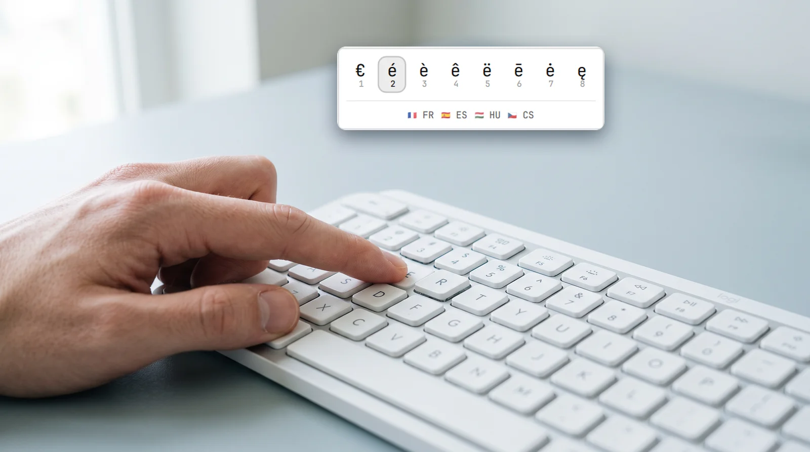
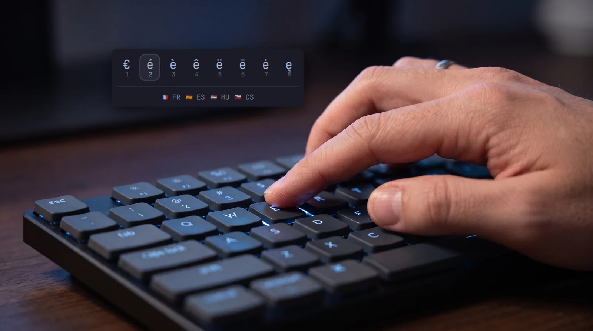

<div align="center">

# Oh là là

**Accents the phone way, on Omarchy.**
Hold a letter, pick é, ñ, ü or č from a popup.

`de.gransoftware.ohlala`&nbsp;&nbsp;·&nbsp;&nbsp;&nbsp;

<br>

&nbsp;

<sub>Follows the active Omarchy theme and font — Snow and Tokyo Night here.</sub>

</div>

<br>

## Install

```bash
sudo pacman -S --needed keyd wtype wl-clipboard jq
omarchy plugin add https://github.com/gran-software-solutions/ohlala-omarchy-plugin.git --enable --yes
~/.config/omarchy/plugins/de.gransoftware.ohlala/bin/ohlala setup
```

### What you install, and why

Omarchy can't tell a quick tap of `e` from a long hold, so the plugin needs a little help:

| Package | What it does here |
| --- | --- |
| [keyd](https://github.com/rvaiya/keyd) | Notices when you hold a letter. A tap still types the letter as usual. |
| wtype | Types the character you picked into terminals. |
| wl-clipboard | Pastes the character in other apps, like the browser, then puts your clipboard back. |
| jq | Passes the list of characters to the popup. |

All four come from the official Arch repositories.

### What `setup` changes

keyd works for every keyboard on the computer, so it runs as a system service. That's why
`setup` asks for your sudo password. It uses it for two things only:

1. It writes one file, `/etc/keyd/default.conf`, that lists the letters to watch.
2. It turns on the keyd service.

Nothing else is changed. Each letter you hold starts the popup as your own user, not as root.
If you already have your own keyd config, `setup` stops and doesn't touch it. The plugin
never goes online. `ohlala remove` deletes the file again.

Stuck keyboard? Press `Backspace` + `Escape` + `Enter` together to stop keyd right away.

### Update

```bash
omarchy plugin update de.gransoftware.ohlala
```

### Remove

```bash
~/.config/omarchy/plugins/de.gransoftware.ohlala/bin/ohlala remove
omarchy plugin remove de.gransoftware.ohlala
```

The first line deletes `/etc/keyd/default.conf`, so holding a letter does nothing special
anymore. The second deletes the plugin folder.

Left on your computer, in case you use them elsewhere:

- the keyd service, now idle. Turn it off and uninstall it with
  `sudo systemctl disable --now keyd && sudo pacman -Rs keyd`
- wtype, wl-clipboard and jq. Keep them: Omarchy and other apps use them too
- your own letter list, if you made one: `~/.config/ohlala`

## Use

Hold a letter for a moment and the popup appears. Hold `Shift` too for capitals.

| | |
| --- | --- |
| `1` – `9` | Pick that character |
| the same letter · `→` · `l` · `Tab` | Next |
| `←` · `h` | Previous |
| `Enter` · `Space` · click | Pick the highlighted one |
| any other key · click outside | Cancel |

Below the row you see which languages use the highlighted letter.

## Your own letters

Copy the defaults and edit them:

```bash
mkdir -p ~/.config/ohlala
cp ~/.config/omarchy/plugins/de.gransoftware.ohlala/accents.conf ~/.config/ohlala/
```

Each line is `letter = characters`, in popup order:

```ini
e = é è ê ë
s = š ß ś
S = Š ẞ Ś
```

Capitals come for free; add an uppercase line only to change them. New
characters for a letter work right away. After you add or remove a letter, run
`bin/ohlala setup` again so keyd watches the right keys.

<details>
<summary><b>How it works</b></summary>
<br>

keyd turns every configured letter into "tap types the letter, hold for 350 ms
runs `bin/ohlala <letter>`". That script finds your Hyprland session and asks
the kept-loaded overlay inside `omarchy-shell` to show the popup, so there is
no cold start.

When you pick, the overlay calls `bin/ohlala type <char>`. In terminals it types
the character with `wtype`. Everywhere else it pastes it and puts your previous
clipboard back, because Chromium drops characters that `wtype` types.

</details>

## Vibe-coded

Every line of this plugin was written by [Claude](https://claude.com/claude-code)
from conversational prompts. keyd runs as root and the overlay runs unsandboxed
inside `omarchy-shell`, so read the source before you enable it.

## License

[MIT](LICENSE) © Gran Software Solutions
